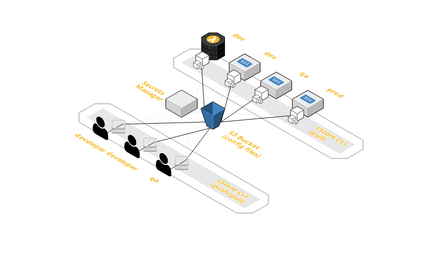

# README

The cStore CLI provides commands to push files `$ cstore push {{file}}` to remote storage. The pushed files are replaced by a catalog file, `cstore.yml`, that understands folder context, storage location, file encryption, and other details making restoration as simple as `$ cstore pull {{file}}`.

`*.env` and `*.json` files are special file types. Their contents can be parameterized with tokens, encrypted, and pushed to storage locations like AWS S3.

TL;DR: cStore encrypts and stores environment configuration remotely using storage like AWS S3 and restores the configuration anywhere including Docker containers using a catalog file `cstore.yml` which can be checked into source control or stored with a project without exposing configuration or secrets.

### Example ###
```
├── project
│   ├── components
│   ├── models
│   ├── main.go
│   ├── Dockerfile 
│   ├── cstore.yml (catalog)
│   └── env
│       └── dev
│       │   └── .env (stored)
|       |   └── .cstore (ghost)
|       |   └── fargate.yml
│       |   └── docker-compose.yml
│       │
│       └── qa
│           └── .env (stored)
|           └── .cstore (ghost)
|           └── fargate.yml
│           └── docker-compose.yml
```
The `cstore.yml` catalog and hidden `.cstore` ghost files take the place of the stored `*.env` files. The `*.env` files can be encrypted and stored in AWS S3 and no longer checked into source control.

When the repository has been cloned or the project shared, running `$ cstore pull` in the same directory as the `cstore.yml` catalog file or any of the `.cstore` ghost replacement files will locate, download and decrypt the `*.env` files to their respective original paths restoring the project's environment configuration.

## How to Use (3 minutes) ##

Ensure a supported [storage](docs/STORES.md) location is already set up and available.

#### Install/Upgrade ####
mac: `$ sudo curl -L -o  /usr/local/bin/cstore https://github.com/turnerlabs/cstore/releases/download/v2.0.0-alpha/cstore_darwin_amd64 && sudo chmod +x /usr/local/bin/cstore`

linux: `$ sudo curl -L -o  /usr/local/bin/cstore https://github.com/turnerlabs/cstore/releases/download/v2.0.0-alpha/cstore_linux_386 && sudo chmod +x /usr/local/bin/cstore`

The first push creates a catalog file in the same directory that can be checked into source control. Subsequent commands executed in the same directory will use the existing catalog.

By default, cStore will use the [AWS credential chain](https://docs.aws.amazon.com/sdk-for-go/v1/developer-guide/configuring-sdk.html) and prompt for an AWS S3 Bucket ([create](docs/S3.md)).

### Store Files ###
```bash
$ cstore push {{file}}
```

Multiple files can be discovered and pushed in one command. If needed, replace `service` with a custom environments folder or `.` to search all project sub folders.
```bash
$ cstore push $(find service -name '*.env')
```

### Restore Files ###
```bash
$ cstore pull {{file}}
```

Instead of restoring files locally, export environment variables listed inside the files. 
```bash
$ eval $( cstore pull {{file}} -e ) # works for '*.env' files only
```

## Architecture Example (AWS) ##




## Advanced Usage ##

* [Migrate from v1 to v2](docs/MIGRATE.md) (breaking changes)
* [Set Up S3 Bucket](docs/S3.md)
* [Access Config in Docker Container](docs/DOCKER.md)
* [Storing/Injecting Secrets](docs/SECRETS.md)
* [Ghost Files (.cstore)](docs/GHOST.md)
* [Tagging Files](docs/TAGGING.md)
* [Versioning Files](docs/VERSIONING.md)
* [Linking Catalogs](docs/LINKING.md)
* [CLI Commands and Flags](docs/CLI.md)

## Project Details ##

* [Goals](docs/GOALS.md)
* [Integration Testing](docs/TESTING.md)
* [Publish Release](docs/PUBLISH.md)

## Additional Info ##

* [Terms](docs/TERMS.md)
* [Stores](docs/STORES.md)
* [Vaults](docs/VAULTS.md)
* [Terraform State Files](docs/TERRAFORM.md)
